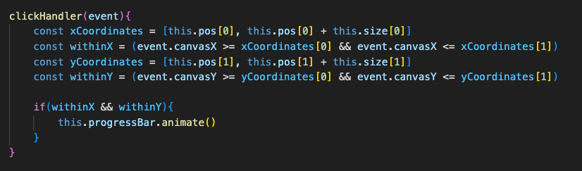
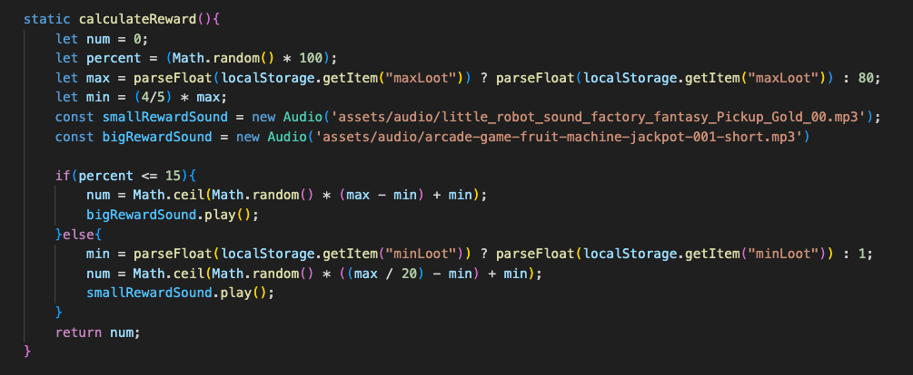
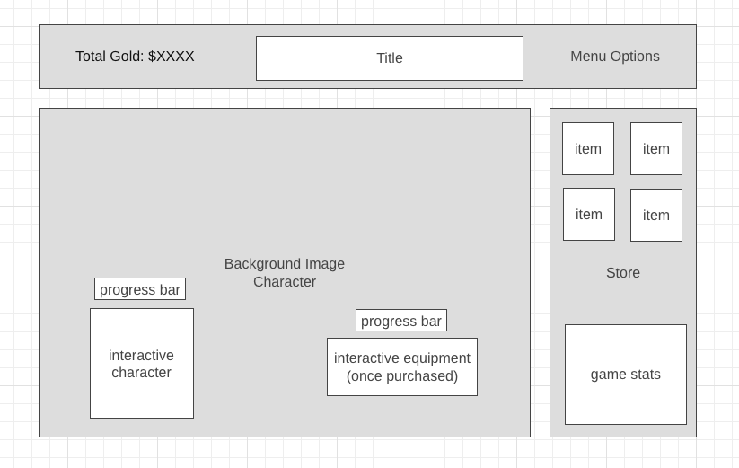

# Nugget Rush Tycoon

Dive into the digital adaptation of "Nugget Rush", inspired by a classic board game. Created in a week as a front-end application, it utilizes the Canvas API for smooth gameplay. Join the quest to become a millionare!

## GamePlay

## MVP & Features
In  `Nugget Rush Tycoon` users will be able to:

* Interact with canvas drawings

* Show a loading bar, character animation and sound effect
* Purchase items from the shop
* Recieve ammounts of gold

* Keep a running total

In addition, this project will include:

* Set a maximum amount of gold
* Item-specific store inventory
* Scalable code
* Background music
* Sophisticated styling

## WireFrames

[View WireFrame]

## Technoledgies, Libraries & APIs

* Canvas
* Vanilla JavaScript

## Implementation TimeLine

Friday Afternoon & Weekend
* Add header / shop canvas elements
* Add background image
* Create button functionality
* Add running total
* Develop randomness logic

Monday
* Implement sprites + game assets
* Build shop functionality
    * Pay for hired-help (auto-clickers)
    * Modify nugget probablities
    * Purchase new equipment

Tuesday
* Add animations
* Add sound effects

Wednesday
* Add menu options
    * Add mute button
    * Add pause button
* Create win/lose conditions

Thursday Morning
* Finishing touches

## Future Additions
* Expanded shop
* New canvas element for each item
* Complex animations
* Random Adversity events 

[View Wireframe]: https://wireframe.cc/foA2oU